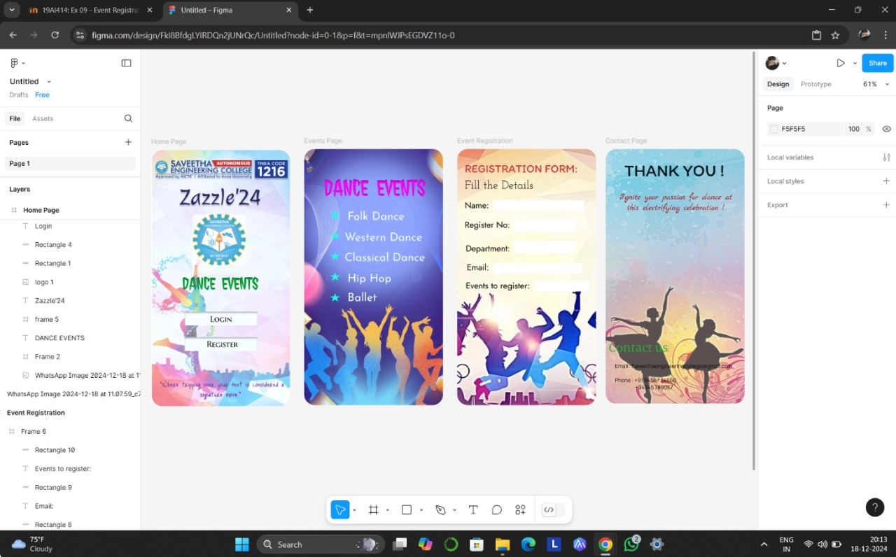

# Ex09 Event Registration Web Application
## Date:
19.12.2024
## AIM:
To design, develop and deploy a web application for event registration.

## DESIGN STEPS:

### Step 1:
Create a new frame.

### Step 2:
Select any one preset size of your choice.

### Step 3:
Select the shapes you need.

### Step 4:
Import images as needed.

### Step 5:
Create pages based on your need and link them.

### Step 6:

Validate the HTML and CSS code.

### Step 6:

Publish the website in the given URL.

## DESIGN TOOL:
Figma

## CODE:
```
Home Page

<div style="width: 391px; height: 723px; position: relative; background: white; border-radius: 30px; overflow: hidden">
  <div style="width: 391px; height: 723px; left: 0px; top: 0px; position: absolute; background: white">
    
    <div style="width: 200px; height: 53px; left: 146px; top: 394px; position: absolute"></div>
    <div style="width: 324px; left: 33px; top: 348px; position: absolute; text-align: center; color: #00A830; font-size: 48px; font-family: Jolly Lodger; font-weight: 400; word-wrap: break-word">DANCE  EVENTS</div>
    <div style="height: 200px; padding-top: 28px; padding-bottom: 28px; padding-left: 92px; padding-right: 148px; left: 25px; top: 153px; position: absolute; justify-content: flex-start; align-items: center; display: inline-flex">
      
    </div>
    <div style="width: 269px; height: 92px; left: 61px; top: 83px; position: absolute; text-align: center; color: #262965; font-size: 64px; font-family: Julee; font-weight: 400; line-height: 100px; word-wrap: break-word">Zazzle'24</div>
    
    <div style="width: 205px; height: 39px; left: 95px; top: 456px; position: absolute; background: #F7FEFF; box-shadow: 0px 4px 4px rgba(0, 0, 0, 0.25) inset"></div>
    <div style="width: 205px; height: 39px; left: 94px; top: 528px; position: absolute; background: #F7FEFF; box-shadow: 0px 4px 4px rgba(0, 0, 0, 0.25) inset"></div>
    <div style="width: 204px; height: 36px; left: 95px; top: 456px; position: absolute; text-align: center"><span style="color: black; font-size: 24px; font-family: Marcellus SC; font-weight: 400; word-wrap: break-word">Login</span><span style="color: black; font-size: 32px; font-family: Marcellus SC; font-weight: 400; word-wrap: break-word"> </span></div>
    <div style="width: 201px; height: 39px; left: 100px; top: 528px; position: absolute; text-align: center; color: black; font-size: 24px; font-family: Marcellus SC; font-weight: 400; word-wrap: break-word">Register</div>
  </div>
  <div style="width: 593px; height: 194px; left: -101px; top: 538px; position: absolute; text-align: center"><span style="color: black; font-size: 24px; font-family: Just Me Again Down Here; font-weight: 400; line-height: 100px; word-wrap: break-word"><br/></span><span style="color: #7B1EA9; font-size: 24px; font-family: Just Me Again Down Here; font-weight: 400; line-height: 100px; word-wrap: break-word">signature move.”</span></div>
  <div style="width: 564px; left: -82px; top: 610px; position: absolute; text-align: center; color: #794095; font-size: 24px; font-family: Just Me Again Down Here; font-weight: 400; line-height: 100px; word-wrap: break-word">“Where tripping over your feet is considered a </div>
</div>

Events Page 

<div style="width: 391px; height: 723px; position: relative; background: white; border-radius: 30px; overflow: hidden">
  
  <div style="width: 324px; left: 37px; top: 71px; position: absolute; text-align: center; color: #FA06FA; font-size: 64px; font-family: Jolly Lodger; font-weight: 400; word-wrap: break-word">DANCE  EVENTS</div>
  <div style="padding-top: 26px; padding-left: 96px; left: 22px; top: -9px; position: absolute; justify-content: flex-end; align-items: center; display: inline-flex">
    <div style="width: 268px; height: 74px; position: relative"></div>
  </div>
  <div style="width: 204px; height: 21px; left: 122px; top: 181px; position: absolute; color: black; font-size: 32px; font-family: Josefin Sans; font-weight: 400; word-wrap: break-word">Folk Dance</div>
  <div style="width: 204px; height: 21px; left: 122px; top: 181px; position: absolute; color: #F0FEFF; font-size: 32px; font-family: Josefin Sans; font-weight: 400; word-wrap: break-word">Folk Dance</div>
  <div style="width: 247px; height: 44px; left: 114px; top: 229px; position: absolute; color: #F0FEFF; font-size: 32px; font-family: Josefin Sans; font-weight: 400; word-wrap: break-word">Western Dance</div>
  <div style="width: 240px; height: 41px; left: 114px; top: 287px; position: absolute; color: #F0FEFF; font-size: 32px; font-family: Josefin Sans; font-weight: 400; word-wrap: break-word">Classical Dance</div>
  <div style="width: 236px; height: 48px; left: 122px; top: 343px; position: absolute; color: #F0FEFF; font-size: 32px; font-family: Josefin Sans; font-weight: 400; word-wrap: break-word">Hip Hop</div>
  <div style="width: 220px; height: 43px; left: 122px; top: 399px; position: absolute; color: #F0FEFF; font-size: 32px; font-family: Josefin Sans; font-weight: 400; word-wrap: break-word">Ballet</div>
</div>

Registration Page

<div style="width: 391px; height: 723px; position: relative">
  <div style="width: 349px; height: 28px; left: 21px; top: 50px; position: absolute; color: #D03333; font-size: 32px; font-family: Itim; font-weight: 400; word-wrap: break-word">REGISTRATION FORM:</div>
  <div style="width: 349px; height: 28px; left: 21px; top: 50px; position: absolute; color: #D03333; font-size: 32px; font-family: Itim; font-weight: 400; word-wrap: break-word">REGISTRATION FORM:</div>
  <div style="width: 349px; height: 28px; left: 21px; top: 50px; position: absolute; color: #D03333; font-size: 32px; font-family: Itim; font-weight: 400; word-wrap: break-word">REGISTRATION FORM:</div>
  <div style="width: 256px; height: 28px; left: 102px; top: 154px; position: absolute; background: white"></div>
  <div style="width: 275px; height: 51px; left: 21px; top: 87px; position: absolute; color: black; font-size: 32px; font-family: Josefin Slab; font-weight: 400; word-wrap: break-word">Fill the Details</div>
  <div style="width: 112px; height: 28px; left: 21px; top: 154px; position: absolute; color: black; font-size: 24px; font-family: Jost; font-weight: 400; word-wrap: break-word">Name:</div>
  <div style="width: 161px; height: 27px; left: 21px; top: 209px; position: absolute; color: black; font-size: 24px; font-family: Jost; font-weight: 400; word-wrap: break-word">Register No:</div>
  <div style="width: 100px; height: 100px; left: 147px; top: 176px; position: absolute"></div>
  <div style="width: 174px; height: 36px; left: 159px; top: 209px; position: absolute; background: white"></div>
  <div style="width: 158px; height: 27px; left: 24px; top: 276px; position: absolute; color: black; font-size: 24px; font-family: Jost; font-weight: 400; word-wrap: break-word">Department:</div>
  <div style="width: 174px; height: 35px; left: 159px; top: 268px; position: absolute; background: white"></div>
  <div style="width: 144px; height: 43px; left: 27px; top: 321px; position: absolute; color: black; font-size: 24px; font-family: Jost; font-weight: 400; word-wrap: break-word">Email:</div>
  <div style="width: 249px; height: 31px; left: 103px; top: 330px; position: absolute; background: white"></div>
  <div style="width: 191px; height: 62px; left: 24px; top: 364px; position: absolute; color: black; font-size: 24px; font-family: Jost; font-weight: 400; word-wrap: break-word">Events to register:</div>
  <div style="width: 153px; height: 31px; left: 217px; top: 380px; position: absolute; background: white"></div>
</div>

Contact Page


<div class="container">
        <h1>THANK YOU!</h1>
        <p>Ignite your passion for dance at this electrifying celebration!</p>
        <h2>Contact Us</h2>
        <p>Email: saveethaengineeringcollege@gmail.com</p>
        <p>Phone: +91 95674 36568 <br> +044 56789057</p>
    </div>
```


## OUTPUT:


## RESULT:
The program to design, develop and deploy a web application for event registration is completed successfully.
